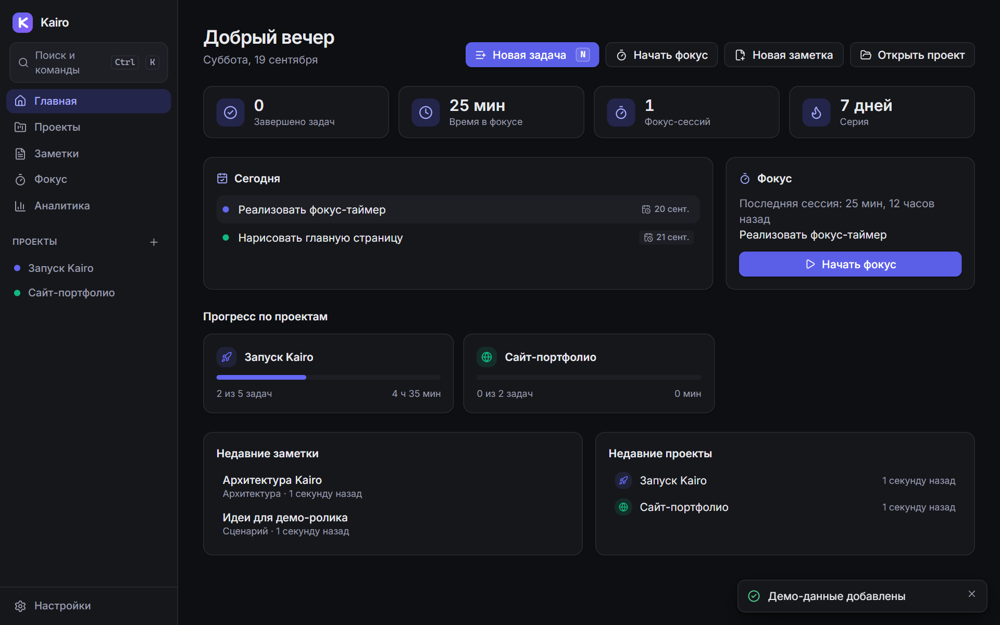
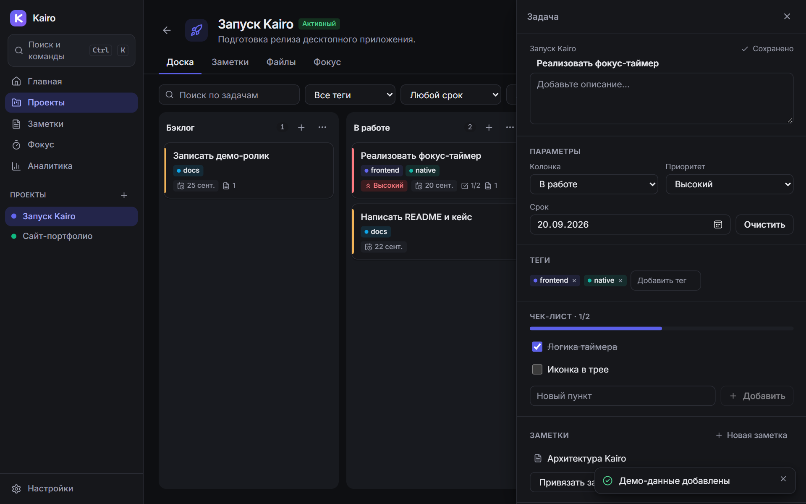

# Kairo

**Local-first desktop workspace for projects, tasks, notes and focus.**
`Plan → Focus → Work → Capture → Review` in one offline app: no account, no server, your data stays in a local SQLite file.

> Tauri 2 · Rust · SQLite · React 18 · TypeScript · Tailwind · Zustand · dnd-kit · Recharts




More: [notes](docs/screenshots/03-notes.png) · [focus](docs/screenshots/04-focus.png) · [analytics](docs/screenshots/05-analytics.png) · [command palette](docs/screenshots/09-command-palette.png) · [light theme](docs/screenshots/07-board-light.png) · [settings](docs/screenshots/08-settings.png). Case study: [docs/CASE_STUDY.md](docs/CASE_STUDY.md).

## What it does

| Area | Highlights |
|---|---|
| **Projects** | Statuses (active / paused / completed / archived), colour + icon, progress, per-project board / notes / files / focus history |
| **Kanban** | Custom columns (rename, reorder, "done" column), drag & drop with persistent order, inline quick add (`Write docs #docs !high`), filters, side panel with checklist, tags, deadline, linked notes and focus time |
| **Notes** | Markdown editor with live preview, formatting toolbar, task-list toggling in the preview, tags, project + task links, full-text search, autosave with explicit *saved / saving / error* state |
| **Focus** | Work / short / long break, configurable, bound to a task, runs in Rust (survives a hidden window), system tray countdown, native notification + chime |
| **Analytics** | Day / week / custom period, completed tasks, sessions, focus time, per-project and per-tag breakdown, streak |
| **Files** | Links to local files and folders (paths only), open in the system app / reveal in folder, clear "file moved" state |
| **Data** | JSON export / import with schema validation and automatic safety copy, SQLite backup, reset, demo data |
| **Desktop UX** | Command palette (`Ctrl+K`), quick open (`Ctrl+P`), keyboard-first, RU / EN without restart, Light / Dark / System theme |

Keyboard: `Ctrl+K` palette · `Ctrl+P` search · `N` new task · `Ctrl+Enter` save/confirm · `Esc` close · `Space` pause/resume timer · `Ctrl+1…6` navigation.

## Architecture

```
React UI  →  modules/* (feature layer)  →  lib/repositories  →  lib/ipc  →  Tauri IPC
                                                                         ↓
                                     Rust commands (thin, async, validated) → db/* (SQLite) · services/* (timer, tray, notifications)
```

* **SQLite is the source of truth.** Zustand only caches what was last read; every mutation goes through IPC and re-reads. Positions are integers renumbered inside a transaction (`move_task`).
* **The timer lives in Rust** (`services/timer.rs`, a pure state machine with an injected clock, unit-tested). A ticker thread emits `timer-state` events and updates the tray, so a session keeps running with the window hidden; closing the window during a session hides it to the tray.
* **Typed IPC contract.** Every command returns a structured `AppError { code, message }`; the UI maps codes to human-language messages with a next step.
* **Import is all-or-nothing.** The backup is validated structurally first, then imported in one transaction with foreign-key verification; the previous data is exported to `<app data>/backups` beforehand.
* **Security.** Markdown is sanitised, raw HTML and remote images are not rendered, links open only through the system browser and only for `http(s)` / `mailto`. File paths never leave the machine. CSP is locked to `self`.
* **Browser fallback.** `lib/ipc/mock.ts` implements the same command contract in memory, so the UI can be developed and end-to-end tested in a plain browser.

```
src/                     React app        src-tauri/src/
  app/                   shell, routes      commands/   IPC layer (projects, tasks, notes, files, timer, analytics, data, settings)
  modules/               dashboard,         db/         SQLite access, migrations, backup, demo data, analytics queries
    projects tasks notes focus analytics    services/   timer state machine, runtime glue, tray
  components/            design system      migrations/ SQL schema
  store/ lib/ i18n/      state, IPC, RU/EN  tests/      Rust integration tests
tests/e2e/               Playwright scenarios
```

## Run

Requirements: Node 20+, Rust (stable) and the platform prerequisites of [Tauri 2](https://tauri.app/start/prerequisites/) (on Windows: WebView2 and MSVC Build Tools).

```bash
npm install
npm run tauri dev        # desktop app with hot reload
npm run dev              # browser preview with the in-memory backend
npm run tauri build      # installer in src-tauri/target/release/bundle
```

### Windows without MSVC (GNU toolchain)

The project also builds with the GNU toolchain (`rustup default stable-x86_64-pc-windows-gnu` + a MinGW-w64 such as WinLibs). The GNU linker cannot handle non-ASCII paths, so build from an ASCII path (e.g. a junction) and keep the target directory there:

```powershell
scripts\tauri.ps1 build --bundles nsis     # sets PATH and CARGO_TARGET_DIR=C:\kairo-target
```

## Tests

```bash
npm test                                   # Vitest: quick-add parser, markdown helpers, utils, i18n
cargo test --no-default-features           # Rust: repositories on in-memory SQLite, move_task, import/export round-trip, timer, analytics
npm run e2e                                # Playwright: the critical scenarios below
npm run smoke:native                       # real desktop build over WebView2/CDP: IPC, timer, DB, export/import
```

E2E scenarios: project → task → In Progress → Done (real pointer drag) · reorder persistence · focus session → history → analytics (fake clock) · note ↔ task link surviving a reload · export → reset → import · invalid backup rejected · onboarding → demo workspace · RU/EN + theme switch without reload · command palette by keyboard only · Markdown sanitisation.

`--no-default-features` builds the domain/db/timer core without the Tauri shell, so logic tests need no webview.

## Data

The database lives in the OS app-data directory (`kairo.db`, WAL mode). Settings → *Data* shows the exact path. Exports are **plain, unencrypted** files and are labelled as such in the app.

## Decisions worth knowing

* `rusqlite` (bundled SQLite) instead of an async ORM: a thin native layer, a smaller binary and synchronous transactions that are easy to reason about.
* Notes search uses SQL `LIKE` with escaped wildcards. That is instant for personal-scale data; FTS5 would be the next step for very large libraries.
* Board columns are reordered from the column menu (accessible, no second drag context); cards use dnd-kit with pointer and keyboard sensors (`Space` to lift).
* Analytics are computed in SQL per local calendar day: the UI sends its UTC offset, so "today" is the user's today.
